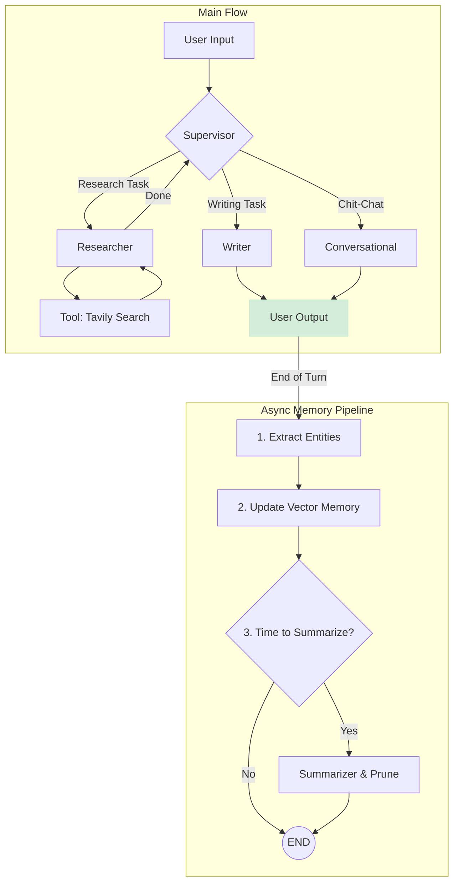

# Advanced Conversational Agent with Hybrid Memory

This directory contains the LangGraph Studio configuration for an advanced, multi-agent system designed to demonstrate robust and production-ready memory management techniques.

## Project Overview

This agent showcases a sophisticated architecture that goes beyond simple conversation. It's built around a "Supervisor" pattern, orchestrating a team of specialist agents to handle complex user requests while maintaining deep, multi-layered context across sessions.

The core of this project is its **hybrid, low-latency memory system**, designed to be both intelligent and efficient.

## Key Architectural Features

-   **Multi-Agent System**: A supervisor delegates tasks to three distinct specialists:
    -   `Researcher`: Finds information using tools.
    -   `Writer`: Synthesizes information into reports.
    -   `Conversational`: Handles greetings and small talk.
-   **Hybrid Long-Term Memory**: The agent combines three techniques for a comprehensive memory:
    1.  **Summarization**: Periodically summarizes the conversation to maintain a high-level context without overflowing the context window.
    2.  **Entity Extraction**: Dynamically builds a structured `user_profile` (name, location, preferences) from the conversation.
    3.  **Vector Store**: Each conversation turn is embedded and stored in a Supabase (Postgres with pgvector) database, allowing for semantic retrieval of relevant past details.
-   **Low-Latency Memory Updates**: Memory maintenance operations (entity extraction, vector storage, summarization) are performed in a separate branch of the graph *after* a response has been sent to the user, ensuring a fast and responsive user experience.
-   **Observability**: Key functions are decorated with `@traceable` for deep visibility and debugging within LangSmith.

## Agent Flow Diagram

This diagram illustrates the decision-making and data flow within the agent system.



## How to Run This Demo

1.  Navigate to the `08_memory_management/` directory.
2.  Ensure your `studio/.env` file is correctly configured with your API keys.
3.  Run the following command:
    ```bash
    langgraph dev
    ```
4.  Open your browser to `http://localhost:8001` to interact with the agent via LangGraph Studio.
